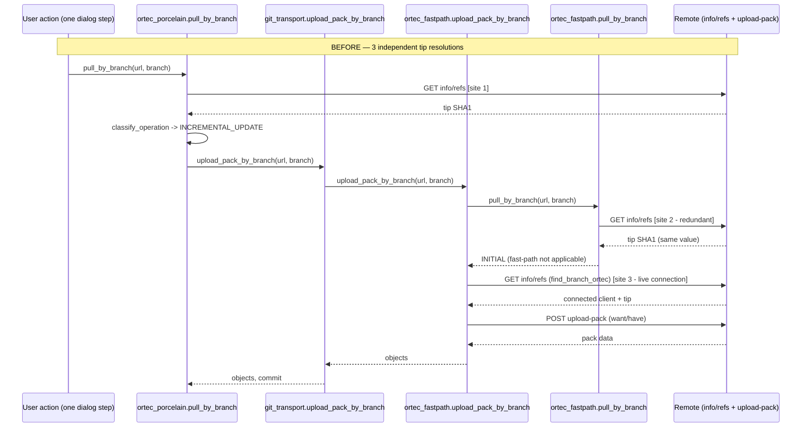
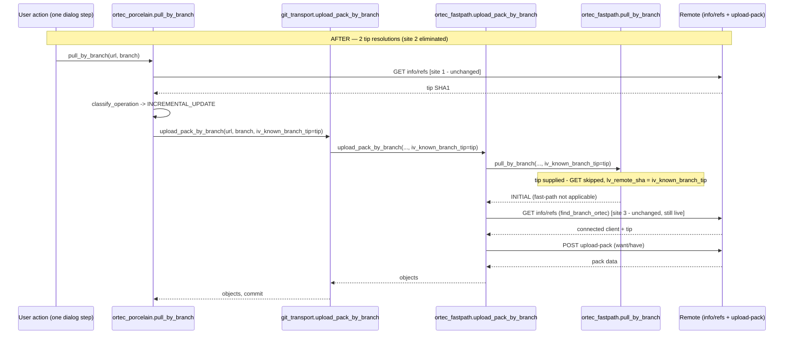

# F2-BRANCH-TIP-DEDUP-DESIGN — Reuse a single resolved branch tip within one user action

```text
PACKET=COMPACT_HANDOFF_V1
TASK_ID=F2-BRANCH-TIP-DEDUP-DESIGN
BASELINE_HEAD=36839c7faa55b4568c1724cf6232468957f6aac8 (branch ortec/abapgit_1_133-opt-rework)
PHASE=DESIGN (read-only, no code changes in this artifact)
TOPIC=standalone perf slice — backlog candidate F-2 only. Does NOT reopen
  Package E, Package C's certified-have classification work, or any other
  backlog candidate (F-1/F-3/F-4/F-5).
SOURCE_EVIDENCE=.memory/logs/abapgit_git_serialization_perf_discovery.md §1/§2.2,
  .memory/logs/abapgit_git_serialization_perf_backlog.md candidate F-2,
  .memory/reviews/abapgit_git_serialization_perf_review.md Finding 1
  (adopted correction: the real second/third redundant call lives inside
  zcl_abapgit_ortec_fastpath, not zcl_abapgit_git_transport's standard
  find_branch fallthrough, which is unreachable for ORTEC-active repos)
STATE_WRITE_ALLOWED=no — this design does not touch .memory/state.md
DIAGRAM_WRITE_ALLOWED=no — sequence diagrams below are inline Mermaid only,
  no separate diagram file created
```

## 0. Scope and non-goals

**In scope:** eliminate the redundant, independent `branches()`/info-refs-class
HTTP resolution of the *same* branch tip that occurs more than once within a
*single* `zcl_abapgit_ortec_porcelain=>pull_by_branch` top-level call, by
threading the already-resolved tip value down the existing call chain as an
explicit, optional method parameter.

**Explicit non-goals** (per hard constraints):
- Does **not** change `zcl_abapgit_ortec_have_policy=>classify_operation`'s
  classification semantics, inputs, or its `ZAOG_COMMIT_HIST`/`ZAOG_REPO_STATE`
  (via `zcl_abapgit_ortec_mat_state`) read/write contract. `classify_operation`
  is not modified at all in this design — it keeps calling with exactly the
  same `iv_target_commit` value it receives today.
- Does **not** introduce any persistent (DB-backed) or `CLASS-DATA` cache of
  any kind. The only "storage" for the shared value is an ordinary method
  local variable / parameter passed by value down a synchronous ABAP call
  stack — it ceases to exist the instant the top-level call returns (see §5).
- Does **not** touch fetch mode: no deepen/shallow value, no per-object
  network call, no progressive-deepen strategy is added, removed, or altered.
  This design only changes **which piece of code performs the info/refs GET
  that resolves a branch name to a SHA1**, never **what is fetched** or
  **how much history/how many blobs** are requested. Trivially compliant
  with `.github/skills/git-partial-clone/SKILL.md` because the wire-level
  fetch methods (`acquire_blobless_graph`, `materialize_tip_snapshot`,
  `upload_pack`, `find_branch_ortec`) are untouched.
- Does **not** fold in F-1, F-3, F-4, or F-5.
- Does **not** attempt to collapse `zcl_abapgit_ortec_filter_walk`'s
  independent `branches()` call (call site 4) into this mechanism — proven
  unsafe/inapplicable in §7.4, kept fully independent.

## 1. Corrected call-chain recap (adopts review Finding 1)

Four independent info/refs-class resolutions were originally cited; source
reading in this design pass confirms the corrected chain and adds one
previously-undocumented detail (the retry-cascade re-triggers call site 2 and
3 a second time). Numbering below is used consistently through the rest of
this document:

| # | File : Method : Anchor | Purpose of the call | Also returns a live connected `zcl_abapgit_http_client`? |
|---|---|---|---|
| 1 | `zcl_abapgit_ortec_porcelain.clas.abap` : `pull_by_branch` : ~line 191, `lv_target_commit = zcl_abapgit_git_transport=>branches( iv_url )->find_by_name( iv_branch_name )-sha1.` | Resolve the tip **before** calling `zcl_abapgit_ortec_have_policy=>classify_operation` | No — result (`li_branch_list`) is discarded after one field access |
| 2 | `zcl_abapgit_ortec_fastpath.clas.abap` : `pull_by_branch` : ~line 673, `li_branches = zcl_abapgit_git_transport=>branches( iv_url ).` | "Discover remote branch tip early" for its own Phase 1b (resume-decode match) / Phase 2-3 (remote-unchanged reconstruction) checks | No — same pattern, value-only use |
| 3 | `zcl_abapgit_ortec_fastpath.clas.abap` : `upload_pack_by_branch` : ~line 948 (first attempt), ~992 (self-contained retry), ~1036 (recovery-tier retry), via `zcl_abapgit_git_transport=>find_branch_ortec` | Resolve the **authoritative, just-in-time** tip immediately before the actual `want`/fetch, **and** open the live HTTP connection the subsequent `upload_pack()` POST is sent over | **Yes** — `eo_client` is the connection literally reused for the POST |
| 4 | `zcl_abapgit_ortec_filter_walk.clas.abap` : `get_remote_files_for_stage` : line 132, `li_branches = zcl_abapgit_git_transport=>branches( lv_url ).` | Check whether cached branch/commit state is stale, only on the "no pinned commit" path, from a **different top-level action** (Diff/Stage-by-Transport page render, not a pull) | No |

**Newly documented this pass:** the "Walk," repair cascade in
`zcl_abapgit_ortec_porcelain=>pull_by_branch` (~line 341) calls
`zcl_abapgit_git_transport=>upload_pack_by_branch` a **second** time after
`invalidate_all_history`, which re-enters call sites 2 and 3 again in full —
worst-case cardinality is higher than the discovery/backlog docs stated (see
§2).

## 2. Expected production cardinality (per call site, current/"before")

| Scenario | Site 1 | Site 2 | Site 3 | Site 4 |
|---|---|---|---|---|
| WARM_UNCHANGED | 1 | 0 (never reached — porcelain `RETURN`s before the `upload_pack_by_branch` fallthrough) | 0 | n/a (different action) |
| COLD_BRANCH | 1 | 0 (same reason) | 0 (`acquire_blobless_graph`/`materialize_tip_snapshot` take `iv_tip_commit` as a parameter — confirmed by source read, no independent tip resolution of their own) | n/a |
| INCREMENTAL_UPDATE, typical (no retry) | 1 | 1 | 1 (thin-pack attempt succeeds) | n/a |
| INCREMENTAL_UPDATE, thin+self-contained retry, no history-repair | 1 | 1 | 2 | n/a |
| INCREMENTAL_UPDATE, thin+self-contained+recovery, no history-repair | 1 | 1 | 3 | n/a |
| INCREMENTAL_UPDATE, **with** the "Walk," history-repair retry (main attempt fails locally, not remotely), typical | 1 | 2 (once per `upload_pack_by_branch` invocation) | 2 (once per invocation, thin succeeds each time) | n/a |
| INCREMENTAL_UPDATE, history-repair **and** thin+self-contained+recovery on both attempts (absolute worst case) | 1 | 2 | 6 (3 per invocation × 2 invocations) | n/a |
| Diff/Stage-by-Transport opened standalone | n/a | n/a | n/a | 0 (commit already pinned) or 1 (branch-name-only resolution) |

Cardinality does not scale with repository object count (N/K) — it is a
fixed, small, per-action count driven purely by control flow, not by
repository size. This is why no "1,000 / 40,000 / 1,000,000 objects" scaling
table is meaningful for this specific change (see §9).

## 3. Design mechanism

Thread the already-resolved tip SHA1 (not the whole `li_branch_list` object —
see §8.2 for why) as a new **optional** parameter,
`iv_known_branch_tip TYPE zif_abapgit_git_definitions=>ty_sha1 OPTIONAL`,
through the existing call chain from site 1 down to site 2 only:

```text
zcl_abapgit_ortec_porcelain=>pull_by_branch          [already resolves lv_target_commit — SOURCE, unmodified]
  -> zcl_abapgit_git_transport=>upload_pack_by_branch  [NEW optional param, pure forward]
       -> zcl_abapgit_ortec_fastpath=>upload_pack_by_branch  [NEW optional param, pure forward]
            -> zcl_abapgit_ortec_fastpath=>pull_by_branch     [NEW optional param, CONSUMED here]
```

Site 2 is the only call site whose behavior actually changes: when
`iv_known_branch_tip` is supplied and non-initial, it is used directly instead
of performing its own `branches()` GET. Every other caller of these three
methods that does not pass the new parameter (there are others — see §4.4)
is unaffected: the parameter defaults to not-supplied, and the existing
`ELSE` branch preserves today's code byte-for-byte.

Sites 1, 3, and 4 are **not modified in their own resolution logic** —
only site 1 additionally *forwards* its already-computed value; sites 3 and 4
keep resolving independently for reasons proven in §7.

### 3.1 Before/after sequence — `pull_by_branch`, INCREMENTAL_UPDATE, typical case





## 4. Exact call sites changed

### 4.1 Signature: `zcl_abapgit_git_transport=>upload_pack_by_branch`

```text
FILE_OR_OBJECT=src/git/zcl_abapgit_git_transport.clas.abap
METHOD_OR_DDIC=upload_pack_by_branch (PUBLIC SECTION class-method signature, ~line 12-24)
ANCHOR=
  CLASS-METHODS upload_pack_by_branch
    IMPORTING
      !iv_url          TYPE string
      !iv_branch_name  TYPE string
      !iv_deepen_level TYPE i DEFAULT 1
      !it_branches     TYPE zif_abapgit_git_definitions=>ty_git_branch_list_tt OPTIONAL
    EXPORTING
ACTION=insert
CHANGE=add one line directly below !it_branches:
  !iv_known_branch_tip TYPE zif_abapgit_git_definitions=>ty_sha1 OPTIONAL
INVARIANTS=purely additive OPTIONAL parameter; no existing caller (zcl_abapgit_git_commit,
  zcl_abapgit_git_porcelain, src/repo/stage/zcl_abapgit_merge.clas.abap, or this class's
  own standard fallthrough) passes it, so their behavior is unchanged
SQL_SHAPE=NONE
ERROR_ROLLBACK_FALLBACK=NONE — signature-only change, no new failure mode
TESTS=none required at this layer beyond a syntax check; behavior is exercised via §6
VALIDATION=SAPDiagnose(action="syntax", type="CLAS", name="ZCL_ABAPGIT_GIT_TRANSPORT")
STOP_IF=any existing caller of upload_pack_by_branch is found to pass all parameters
  positionally without keywords (ABAP requires named parameters for optional additions,
  so this cannot silently break a caller — verified: all found callers already use
  named EXPORTING/IMPORTING syntax)
```

### 4.2 Body: `zcl_abapgit_git_transport=>upload_pack_by_branch` — forward only

```text
FILE_OR_OBJECT=src/git/zcl_abapgit_git_transport.clas.abap
METHOD_OR_DDIC=upload_pack_by_branch (implementation, ~line 412-426)
ANCHOR=
  IF zcl_abapgit_ortec_git_switch=>is_active_for_repo( iv_url ) = abap_true.
    TRY.
        zcl_abapgit_ortec_fastpath=>upload_pack_by_branch(
          EXPORTING
            iv_url          = iv_url
            iv_branch_name  = iv_branch_name
            iv_deepen_level = iv_deepen_level
            it_branches     = it_branches
          IMPORTING
ACTION=replace
CHANGE=add one line to the EXPORTING list, directly below it_branches = it_branches:
            iv_known_branch_tip = iv_known_branch_tip
INVARIANTS=the standard (non-ORTEC) fallthrough later in this same method
  (find_branch/upload_pack) is intentionally left untouched — it is unreachable for
  ORTEC-active repos (review Finding 1) and iv_known_branch_tip is only ever populated
  by an ORTEC-active caller, so wiring it into the standard path would be dead code
SQL_SHAPE=NONE
ERROR_ROLLBACK_FALLBACK=unchanged — the existing CATCH zcx_abapgit_ortec_git
  zcx_abapgit_exception around this TRY block is untouched
TESTS=see §6.1 (regression: full existing caller suite unmodified)
VALIDATION=SAPDiagnose(action="syntax")
STOP_IF=none
```

### 4.3 Body: `zcl_abapgit_ortec_porcelain=>pull_by_branch` — anchor call site (source of the value)

```text
FILE_OR_OBJECT=src/ortec/git/zcl_abapgit_ortec_porcelain.clas.abap
METHOD_OR_DDIC=pull_by_branch (implementation, main INCREMENTAL_UPDATE fallthrough, ~line 296-306)
ANCHOR=
  zcl_abapgit_git_transport=>upload_pack_by_branch(
    EXPORTING
      iv_url          = iv_url
      iv_branch_name  = iv_branch_name
      iv_deepen_level = iv_deepen_level
    IMPORTING
      et_objects      = rs_result-objects
      ev_branch       = rs_result-commit
      ev_deepen_used  = lv_deepen_used ).
ACTION=replace
CHANGE=add one line to the EXPORTING list:
      iv_known_branch_tip = lv_target_commit
INVARIANTS=lv_target_commit is the SAME local variable already populated at ~line 191
  by this method's own call site 1 resolution; it is never reassigned between that
  line and this call for the INCREMENTAL_UPDATE path (the WARM_UNCHANGED/COLD_BRANCH
  CASE branches RETURN before reaching this statement). No new variable introduced.
SQL_SHAPE=NONE
ERROR_ROLLBACK_FALLBACK=unchanged
TESTS=see §6.2/§6.3
VALIDATION=SAPDiagnose(action="syntax", type="CLAS", name="ZCL_ABAPGIT_ORTEC_PORCELAIN")
STOP_IF=none
```

```text
FILE_OR_OBJECT=src/ortec/git/zcl_abapgit_ortec_porcelain.clas.abap
METHOD_OR_DDIC=pull_by_branch (implementation, history-repair retry cascade, ~line 337-347)
ANCHOR=
              CLEAR rs_result.
              zcl_abapgit_git_transport=>upload_pack_by_branch(
                EXPORTING
                  iv_url          = iv_url
                  iv_branch_name  = iv_branch_name
                  iv_deepen_level = iv_deepen_level
                IMPORTING
                  et_objects      = rs_result-objects
                  ev_branch       = rs_result-commit
                  ev_deepen_used  = lv_deepen_used ).
ACTION=replace
CHANGE=add one line to the EXPORTING list (identical addition as §4.3's first block):
                  iv_known_branch_tip = lv_target_commit
INVARIANTS=lv_target_commit still holds the ORIGINAL resolved tip; the intervening
  zcl_abapgit_ortec_repo_state=>invalidate_all_history( ) + COMMIT WORK invalidates
  LOCAL history/have-state only — it does not and cannot change what the REMOTE
  branch's tip actually is, so reusing the same value here targets the identical
  commit the first attempt was already targeting (see §7.2 staleness proof, retry case)
SQL_SHAPE=NONE
ERROR_ROLLBACK_FALLBACK=unchanged (existing CATCH zcx_abapgit_ortec_git /
  CATCH zcx_abapgit_exception -> RAISE EXCEPTION lx_pull is untouched)
TESTS=see §6.2
VALIDATION=SAPDiagnose(action="syntax")
STOP_IF=none
```

### 4.4 Signature + body: `zcl_abapgit_ortec_fastpath=>upload_pack_by_branch` — forward only

```text
FILE_OR_OBJECT=src/ortec/git/zcl_abapgit_ortec_fastpath.clas.abap
METHOD_OR_DDIC=upload_pack_by_branch (PUBLIC SECTION signature, ~line 31-42)
ANCHOR=
    CLASS-METHODS upload_pack_by_branch
      IMPORTING
        iv_url          TYPE string
        iv_branch_name  TYPE string
        iv_deepen_level TYPE i DEFAULT 1
        it_branches     TYPE zif_abapgit_git_definitions=>ty_git_branch_list_tt OPTIONAL
      EXPORTING
ACTION=insert
CHANGE=add one line directly below it_branches:
        iv_known_branch_tip TYPE zif_abapgit_git_definitions=>ty_sha1 OPTIONAL
INVARIANTS=this method has exactly one caller in the whole codebase —
  zcl_abapgit_git_transport=>upload_pack_by_branch (§4.2) — confirmed by
  grep across src/**/*.abap; purely additive, zero other callers to audit
SQL_SHAPE=NONE
ERROR_ROLLBACK_FALLBACK=NONE
TESTS=none required at signature level
VALIDATION=SAPDiagnose(action="syntax", type="CLAS", name="ZCL_ABAPGIT_ORTEC_FASTPATH")
STOP_IF=a second, currently-unknown caller of this method is discovered that would
  need the same wiring to benefit — re-scan with
  SAPNavigate(action="references", type="CLAS", name="ZCL_ABAPGIT_ORTEC_FASTPATH")
  filtered to this method before implementation
```

```text
FILE_OR_OBJECT=src/ortec/git/zcl_abapgit_ortec_fastpath.clas.abap
METHOD_OR_DDIC=upload_pack_by_branch (implementation, ~line 913-916)
ANCHOR=
    ls_pull = pull_by_branch(
      iv_url          = iv_url
      iv_branch_name  = iv_branch_name
      iv_deepen_level = iv_deepen_level ).
ACTION=replace
CHANGE=add one line:
      iv_known_branch_tip = iv_known_branch_tip ).
  (i.e. the closing parenthesis moves down one line to accommodate the new
  named parameter; no other line in this method changes — the three
  find_branch_ortec call sites at ~948/992/1036 are NOT touched)
INVARIANTS=this is the ONLY place inside this method's body where the new parameter
  is consumed/forwarded; every find_branch_ortec call remains fully independent
  (see §7.3 — those calls also open the live HTTP connection used for the
  subsequent POST and MUST stay authoritative/live)
SQL_SHAPE=NONE
ERROR_ROLLBACK_FALLBACK=unchanged
TESTS=see §6.1 (regression)
VALIDATION=SAPDiagnose(action="syntax")
STOP_IF=none
```

### 4.5 Signature + body: `zcl_abapgit_ortec_fastpath=>pull_by_branch` — the only behavior-changing edit

```text
FILE_OR_OBJECT=src/ortec/git/zcl_abapgit_ortec_fastpath.clas.abap
METHOD_OR_DDIC=pull_by_branch (PUBLIC SECTION signature, ~line 22-29)
ANCHOR=
    CLASS-METHODS pull_by_branch
      IMPORTING iv_url           TYPE string
                iv_branch_name   TYPE string
                iv_deepen_level  TYPE i DEFAULT 1
      RETURNING VALUE(rs_result) TYPE zcl_abapgit_git_porcelain=>ty_pull_result
      RAISING   zcx_abapgit_ortec_git
                zcx_abapgit_exception.
ACTION=insert
CHANGE=add one line directly below iv_deepen_level:
                iv_known_branch_tip TYPE zif_abapgit_git_definitions=>ty_sha1 OPTIONAL
INVARIANTS=this method has exactly one caller — its own class's upload_pack_by_branch
  (§4.4) — confirmed by grep across src/**/*.abap for
  "zcl_abapgit_ortec_fastpath=>pull_by_branch"; purely additive
SQL_SHAPE=NONE
ERROR_ROLLBACK_FALLBACK=NONE
TESTS=none required at signature level
VALIDATION=SAPDiagnose(action="syntax")
STOP_IF=a second caller is discovered — re-scan before implementation using a
  grep for the bare method name scoped to this file (the one actual call
  site at line 913 is an unqualified, same-class "pull_by_branch(" call;
  the fully-qualified "zcl_abapgit_ortec_fastpath=>pull_by_branch" pattern
  would NOT match it and would give a false "zero callers" result —
  correction per correctness review optional improvement)
```

```text
FILE_OR_OBJECT=src/ortec/git/zcl_abapgit_ortec_fastpath.clas.abap
METHOD_OR_DDIC=pull_by_branch (implementation, "Discover remote branch tip early" block, ~line 671-678)
ANCHOR=
    " Discover remote branch tip early (needed for resume validation)
    TRY.
        li_branches = zcl_abapgit_git_transport=>branches( iv_url ).
        lv_remote_sha = li_branches->find_by_name( iv_branch_name )-sha1.
      CATCH zcx_abapgit_exception.
        RETURN.
    ENDTRY.
ACTION=replace
CHANGE=
    " Discover remote branch tip early (needed for resume validation).
    " F-2: reuse the caller's already-resolved tip (porcelain's own
    " pull_by_branch resolves it a few statements earlier, in the same
    " top-level call, purely for have-policy classification) instead of
    " issuing a second independent info/refs GET for the identical
    " branch. Callers that do not supply it get byte-identical behavior
    " to before this change.
    IF iv_known_branch_tip IS NOT INITIAL.
      lv_remote_sha = iv_known_branch_tip.
    ELSE.
      TRY.
          li_branches = zcl_abapgit_git_transport=>branches( iv_url ).
          lv_remote_sha = li_branches->find_by_name( iv_branch_name )-sha1.
        CATCH zcx_abapgit_exception.
          RETURN.
      ENDTRY.
    ENDIF.
INVARIANTS=
  - INV-1: when iv_known_branch_tip is initial (not supplied, or supplied blank),
    behavior is IDENTICAL to today, statement-for-statement (the ELSE branch is a
    verbatim copy of the original block).
  - INV-2: when iv_known_branch_tip is non-initial, lv_remote_sha is set to EXACTLY
    the value the caller already resolved via its own live branches() GET earlier
    in the same synchronous call stack — never a value from a different top-level
    call, never a value read from any DB table or CLASS-DATA.
  - INV-3: every statement AFTER this block (Phase 1 resume matching, Phase 2
    remote-vs-stored comparison, Phase 3 reconstruction) is UNCHANGED — they consume
    lv_remote_sha exactly as before, with no awareness of where it came from.
SQL_SHAPE=NONE
ERROR_ROLLBACK_FALLBACK=the ELSE branch keeps the original CATCH zcx_abapgit_exception
  -> RETURN exactly as today; the IF branch has no HTTP call to fail, so it introduces
  no new exception path
TESTS=see §6.2, §6.3, §6.4 — this is the block those tests target
VALIDATION=SAPDiagnose(action="syntax", type="CLAS", name="ZCL_ABAPGIT_ORTEC_FASTPATH");
  SAPRead(type="CLAS", name="ZCL_ABAPGIT_ORTEC_FASTPATH", grep="find_branch_ortec")
  re-run after implementation to confirm zero matches were altered (site 3 untouched)
STOP_IF=any statement between the "Discover remote branch tip early" block and the
  method's Phase 1/2/3 logic is found (on re-read at implementation time) to depend
  on li_branches (the branch-list OBJECT, not just its sha1 value) rather than
  lv_remote_sha alone — current source confirms li_branches is never read again
  after this block, only lv_remote_sha is; if that changes, the "pass sha1 only"
  design decision (§8.2) must be revisited before implementing
```

## 5. Sharing-scope safety proof (no cross-request leakage)

The shared value (`lv_target_commit` in porcelain, threaded as
`iv_known_branch_tip`) is:

1. **A plain scalar method parameter/local variable**, never a `CLASS-DATA`
   field, never written to any DB table, never held in any singleton/factory
   instance.
2. **Created fresh on every invocation** of
   `zcl_abapgit_ortec_porcelain=>pull_by_branch` (`DATA lv_target_commit TYPE
   ...` is a method-local declaration) and **destroyed automatically** the
   instant that method returns — standard ABAP stack-frame semantics, no
   explicit "clear/expire" code is needed or possible to forget, because
   there is no persistent object for it to leak from.
3. **Passed only downward**, by value, through three more method calls that
   are all still executing on the same call stack, in the same work process,
   for the same dialog step/HTTP request, before any of them returns.
   **Correction (per correctness review DR-002): the relied-upon invariant
   is call-stack continuity, not absence of `COMMIT WORK`.** The
   history-repair retry cascade (§4.3's second CHANGE block) DOES execute
   `invalidate_all_history(...)` then `COMMIT WORK.` before forwarding the
   SAME `iv_known_branch_tip = lv_target_commit` a second time — so a
   `COMMIT WORK` genuinely occurs between one consumption of the shared
   value and the next. This does not weaken this proof: `COMMIT WORK`
   commits the current LUW to the database, it does not unwind the ABAP
   call stack, end the dialog step/work process, or clear local
   variables/parameters — the actual guarantee this section needs ("still
   the same call stack, same work process, same dialog step, no
   cross-request leakage") holds across a `COMMIT WORK` statement exactly
   as it holds across any other statement in the same method. Separately,
   `invalidate_all_history` blanks `zaog_repo_state-fetch_commit` for the
   whole repo key, which guarantees Phase 2's `IF ls_state-fetch_commit IS
   INITIAL. RETURN.` fires on the retry — so Phase 3's "remote unchanged"
   shortcut cannot fire on the retry attempt regardless of which tip value
   is reused, removing any remaining doubt for this specific path.
4. **Cannot reach a second, later top-level call.** Two separate user
   actions (e.g. a Pull followed by a separate button click that opens the
   Stage page) are two separate invocations of
   `zcl_abapgit_git_porcelain=>pull_by_branch`/`zcl_abapgit_stage_logic` —
   two separate ABAP dialog steps/requests, each starting its own, brand-new
   call stack with its own, brand-new local variables. Nothing in this
   design allocates storage that outlives one such call stack, so there is,
   by construction, no mechanism through which the shared value could leak
   into a later request, a different session, a background job, or a
   different user's work process — the exact leakage class the "never a
   `CLASS-DATA` cache" constraint is worried about is structurally
   impossible here, not merely avoided by discipline.

## 6. Test plan → mapped to §5's scope proof

(kept here, immediately after §5, because the sharing-scope proof and its
test coverage are one argument)

No additional narrative — see §11 for the full "Exact tests required"
section (kept together with the other required-test content per the task
brief's structure).

## 7. Staleness-detection preservation proof — one argument per call site

### 7.1 Site 1 (`zcl_abapgit_ortec_porcelain=>pull_by_branch`'s own resolution)

**Not modified.** It still performs its own, independent, live `branches()`
GET exactly as today, on every call, unconditionally (subject to the same
`lv_ortec_active`/`lv_ortec_repo_key` guard that exists today). Nothing to
prove — behavior is byte-identical.

### 7.2 Site 2 (`zcl_abapgit_ortec_fastpath=>pull_by_branch`'s "discover early")

Claim to prove: reusing site 1's value here cannot cause this method to
**incorrectly treat a moved branch as unchanged** (the only failure mode that
would matter — the reverse, "incorrectly treat an unchanged branch as
moved," only costs an extra real fetch, never correctness, per §7.3's
"final arbiter" argument).

- Today, site 2 performs its **own** fresh GET, at a time strictly *later*
  than site 1's GET (site 1 always runs first, synchronously, with no yield
  point in between for the INCREMENTAL_UPDATE path — confirmed by re-reading
  `classify_operation`, which does one `zcl_abapgit_ortec_mat_state=>get_state`
  SELECT and, for the paths that reach `upload_pack_by_branch`, at most one
  `get_certified_haves` SELECT, neither of which is HTTP or `COMMIT WORK`).
  Today's two independently-observed tip values are **never cross-checked
  against each other** — the existing code has no logic anywhere that
  compares site 1's `lv_target_commit` against site 2's `lv_remote_sha`. So
  today's design already tolerates the possibility that these two GETs,
  microseconds apart, observe different values, with **zero explicit
  reconciliation**; whichever value site 2 happened to observe is simply
  used for its own Phase 1b/2/3 decisions.
- Under this design, site 2 uses **exactly** site 1's already-observed value
  instead of taking a second, independent sample of the same
  fast-changing/not-changing quantity a few statements later. This removes
  a redundant network round trip; it does not remove a check, because no
  cross-check between the two samples existed to remove.
- The only way this could *matter* is the exotic race where the remote
  moves forward and back again to a value matching
  `ls_state-fetch_commit` (the previously-recorded fetch) within the
  microsecond window between sites 1 and 2 — in that window, today's fresh
  site-2 GET could observe the round-tripped-back value and (correctly, by
  today's own logic) take the Phase 3 "remote unchanged, reconstruct from
  cache" shortcut, while this design's reused value (observed slightly
  earlier, before the round trip) would not match `ls_state-fetch_commit`
  either (since it was captured before the round trip completed) and would
  instead return `INITIAL`, forcing a real fetch to proceed via the Phase 2b
  fallthrough. **Correction (per correctness review DR-001): the supporting
  claim that site 3 "always resolves the truly-current tip live and will
  fetch correctly regardless" is not the reason this is safe** — Phase 1b
  and Phase 3 already never re-verify via site 3, today or after this
  design (§7.3). The actual reason this substitution is safe: whether site
  2 gets its tip value from its own fresh GET (today) or from the reused
  `iv_known_branch_tip` (after this design), the shortcuts' inherent
  "trust the check, don't re-verify at the wire" exposure window is the
  same order of magnitude in both cases — both are separated from the
  relevant remote reality check by a handful of synchronous ABAP
  statements, never a yield point. The substitution does not *widen* an
  existing race window; it only changes which of two adjacent GETs
  supplies the value. **Worst case: one avoidable extra real fetch in an
  astronomically narrow race window (the Phase 2b fallthrough case, which
  genuinely does resolve live via site 3). Never a stale/incorrect
  result.**
- The retry-cascade reuse at §4.3's second block is provably even safer:
  the *target commit itself* has not changed between the first and second
  `upload_pack_by_branch` call (only *local* history/have-state was
  invalidated) — see the CHANGE block's own INVARIANTS note.

### 7.3 Site 3 (`find_branch_ortec`, all three attempts)

**Not modified — deliberately.** **Correction (per correctness review
DR-001): site 3 is the "final arbiter" only on the non-shortcut path.**
`zcl_abapgit_ortec_fastpath=>pull_by_branch` has two early-`RETURN`
shortcuts that bypass site 3 entirely: Phase 1b, resume-decode match
(~line 786, `RETURN. " Success! Avoid redundant GET from remote."`) and
Phase 3, remote-unchanged reconstruction (~line 830, `RETURN.` after
reconstituting from `zaog_obj_store`). `upload_pack_by_branch` itself
`RETURN`s immediately whenever that `pull_by_branch` call returns
non-initial (~line 920), so site 3 (`find_branch_ortec`, ~line 948) is
reached only on the Phase 2b fallthrough — no previous fetch, or the
remote genuinely changed. On that reached path, site 3's own `ev_branch`
output (never `iv_known_branch_tip`) is what actually seeds
`lt_hashes`/`want` for the `upload_pack()` POST that follows on the very
same connection, and staleness further up the call stack (site 1/2's
shared value) has zero effect on what is fetched. This is also why site 3
cannot be collapsed into the shared-value mechanism at all without a much
larger, out-of-scope change (persistent-connection reuse across method
boundaries) — see §10.4. The Phase 1b/Phase 3 shortcuts' own
never-re-verify-via-site-3 exposure is a pre-existing property of
`pull_by_branch`, unrelated to and unchanged by this design (see §7.2).

### 7.4 Site 4 (`zcl_abapgit_ortec_filter_walk=>get_remote_files_for_stage`)

**Not modified — proven inapplicable, not merely "not attempted."**
`zcl_abapgit_ortec_porcelain`, `zcl_abapgit_ortec_fastpath`, and
`zcl_abapgit_git_transport` contain **no call anywhere** into
`zcl_abapgit_ortec_filter_walk` (confirmed: SOURCE_SCOPE files grepped for
`filter_walk`/`get_remote_files_for_stage`/`get_remote_files_for_diff` —
zero matches). Diff/Stage-by-Transport is rendered by an entirely separate
facade (`zcl_abapgit_ortec_git_facade=>resolve_filtered_remote`, wired via
`zcl_abapgit_stage_logic`), reached from a structurally different UI
entry point/dialog step than Pull. Since ABAP local variables/parameters do
not survive past the end of the call that declares them (§5), and no call
edge exists between these two call stacks, there is no mechanism — safe or
unsafe — by which site 1/2's value could reach site 4, even if this design
wanted it to. This satisfies the task's explicit fallback instruction: "If
sharing cannot be proven safe for one specific consumer, that consumer may
keep its own independent resolution" — site 4 keeps it, proven by absence
of any shared call stack rather than by a weaker "we chose not to" argument.

## 8. Before/after HTTP call count (required scenarios)

Counts are for info/refs-class tip-resolution calls only (branches() /
find_branch_ortec), not the actual pack POST(s) or fetch-mode-internal
connection calls, which this design does not touch.

| Scenario | Before | After | Delta |
|---|---|---|---|
| (a) `pull_by_branch` WARM_UNCHANGED | 1 (site 1 only) | 1 (unchanged — path never reaches the modified code) | 0 |
| (b) `pull_by_branch` INCREMENTAL_UPDATE, typical (no retry) | 3 (site 1 + site 2 + site 3×1) | 2 (site 1 + site 3×1; site 2 eliminated) | **−1 (−33%)** |
| (b-worst) INCREMENTAL_UPDATE, thin+self-contained+recovery on both the main attempt and the history-repair retry | 9 (1 + 2×site2 + 6×site3) | 7 (1 + 0×site2 + 6×site3) | **−2** |
| (c) `pull_by_branch` COLD_BRANCH | 1 (site 1 only; cold-graph/materialize calls are fetch-mode-internal, out of scope, unaffected) | 1 (unchanged — path never reaches the modified code) | 0 |
| (d) Diff/Stage-by-Transport opened standalone | 0 or 1 (site 4 only) | 0 or 1 (unchanged — site 4 not touched) | 0 |

Net effect: this design only reduces HTTP calls for the INCREMENTAL_UPDATE
classification, by exactly the number of times `upload_pack_by_branch` is
invoked within one `pull_by_branch` call (1 typical, 2 in the history-repair
retry case) — never more, never for WARM_UNCHANGED/COLD_BRANCH/standalone
Diff-Stage, consistent with §2's cardinality table.

## 9. Performance-map (mandatory section, abap-performance-patterns skill)

- **Expected production cardinality:** not object-count-scaled — see §2.
  This change affects a fixed, small (1-9) count of HTTP round trips per
  `pull_by_branch` call, independent of repository size (1, 1,000, 40,000,
  or 1,000,000 stored objects all produce the identical call counts in §8,
  because the mechanism only touches *how many times a branch name is
  resolved to a SHA1*, never anything that iterates repository objects).
- **SQL-call complexity:** unchanged — **zero new SQL statements**. No DDIC
  object, table, or existing SELECT/INSERT/UPDATE/DELETE is touched by this
  design.
- **HTTP-call complexity:** reduced from up to 2 tip-resolution calls to at
  most 1 per `upload_pack_by_branch` invocation within one `pull_by_branch`
  top-level call (§8); no change to the number of pack-transfer POSTs,
  cold-graph/materialize calls, or blob-batch calls.
- **Row/byte batch policy:** not applicable — no row or byte payload is
  introduced, moved, or batched by this design. The shared value is a single
  40-character SHA1 hex string.
- **Peak-memory model:** not applicable / negligible — one additional scalar
  parameter (a `ty_sha1` string) on an existing call chain; no additional
  XSTRING, table, or buffer is created.
- **Cache scope:** **request-local, single top-level call only** (see §5).
  Explicitly not request-scoped-with-TTL, not session-scoped, not
  repository-scoped, not a `CLASS-DATA` cache of any kind — there is no
  cache in the conventional sense at all, only parameter threading through
  an already-existing synchronous call chain.
- **Transaction owner:** unchanged. This design introduces no new `COMMIT
  WORK`/`ROLLBACK WORK`, and does not change which existing method owns the
  transaction boundaries already documented in the discovery log (§persist_pull_result
  lock/attempt span, unaffected).
- **Large-repository acceptance criteria:** trivially satisfied and
  effectively a non-issue for this design — see §10.

## 10. Large-repository acceptance criteria

This design does not read, write, batch, or iterate any repository-scale
collection (objects, packs, deltas, trees, blobs, paths, or index rows).
The mechanism's cost and behavior are **identical for a 1-object repository
and a 1,000,000-object repository**, because the eliminated HTTP call
(`branches()`) already costs a fixed amount of work per call regardless of
repository object count (its response size scales only with the number of
*refs/branches*, not stored objects, and this design does not change that
response's size or how it is parsed — `zcl_abapgit_git_branch_list` is
untouched). No 1 / 1,000 / 40,000 / 1,000,000-object scaling table is
meaningful here; the acceptance criterion is simply: **the HTTP call counts
in §8 hold regardless of repository size**, which follows directly from the
mechanism having no code path that depends on object/tree/blob volume.

## 11. Rejected alternatives

1. **`CLASS-DATA` singleton cache with a short TTL** (e.g. "cache
   `branches()`'s result for N seconds"). Rejected: this is precisely the
   cross-request leakage risk the task's hard constraints prohibit — a
   value resolved for one user's pull could be served to a different,
   unrelated later top-level call (a different dialog step, a different
   user sharing the same work process, or a background job) within the TTL
   window, and correctly invalidating such a cache on every remote-changing
   event (push, by any client, not just this one) would require a whole new,
   unproven invalidation mechanism — completely out of proportion to the
   1-2-call-per-action saving this design achieves safely with zero new
   state.
2. **Pass the whole `li_branch_list` (`REF TO zif_abapgit_git_branch_list`)
   object down instead of just the resolved SHA1.** Rejected: broader
   surface for no benefit — none of the downstream consumers need any
   *other* branch's data, only the one target branch's SHA1; passing the
   narrower, immutable, trivially-auditable scalar value is strictly safer
   and easier to review (see §4.5's STOP_IF, which would need re-evaluating
   if this were ever revisited).
3. **Move tip resolution into `classify_operation` itself** (so it both
   classifies and returns/caches the tip for reuse). Rejected: violates the
   hard constraint against changing `classify_operation`'s contract, and
   contradicts that class's own documented design invariant, "CLASSIFY_
   OPERATION is a pure certificate read - no HTTP" (its own class-header
   docstring, quoted verbatim) — mixing an HTTP concern into that method
   would be a real, unwanted contract change, not a refactor.
4. **Also collapse site 3 (`find_branch_ortec`) into the shared value.**
   Rejected: site 3 is not a redundant *lookup* — it is the acquisition of
   the live HTTP connection the subsequent `upload_pack()` POST is sent
   over (§7.3). Eliminating it would require a materially different and
   riskier mechanism (keeping an HTTP connection open across method/class
   boundaries and reusing it later), which is out of scope for a "tip
   resolution" design and was never part of what backlog item F-2 asked
   for accepted per its own `PREREQUISITES`/`SCOPE`.
5. **Collapse site 4 (`filter_walk`) into the same shared value.**
   Rejected: proven inapplicable by construction, not just declined — see
   §7.4. No call edge exists between the pull call stack and the Diff/Stage
   call stack, so there is nothing to thread a parameter through even if
   this were desired; per the task's own instruction, this call site keeps
   its independent resolution rather than forcing a one-size-fits-all
   mechanism.

## 12. Exact tests required

### 12.1 Mandatory regression: existing suite must pass unmodified

`src/ortec/git/zcl_abapgit_ortec_fastpath.clas.testclasses.abap`'s full
`ltcl_fastpath` (20 `FOR TESTING` methods — corrected per correctness
review DR-003; `setup`/`teardown`/`cleanup_repo`/`build_commit` are
non-test helpers and are not part of this count) and `ltcl_fastpath_protocol`
test classes must be re-run **without modifying a single existing test
method** and show 0 failures after implementing §4. Every one of those 25 methods calls
`upload_pack_by_branch`/`pull_by_branch`-adjacent APIs (or the primitives
they depend on) without ever supplying the new `iv_known_branch_tip`
parameter — an unmodified pass is direct proof that every existing caller
and scenario these tests already cover is byte-for-byte unaffected. This is
the primary, load-bearing acceptance gate for this design, precisely
**because** of the limitation in §12.2 below.

Likewise, `src/ortec/git/zcl_abapgit_ortec_have_policy.clas.testclasses.abap`'s
existing suite (not read/modified by this design) must pass unmodified —
direct evidence that `classify_operation`'s WARM_UNCHANGED / INCREMENTAL_
UPDATE / COLD_BRANCH classification outcomes are unaffected, since neither
its inputs, its implementation, nor its caller's resolution of
`iv_target_commit` in `zcl_abapgit_ortec_porcelain=>pull_by_branch`
(§4.3's un-touched ~line 191 statement) change in this design.

### 12.2 Known, pre-existing testability ceiling (not introduced by this design)

`zcl_abapgit_ortec_fastpath.clas.testclasses.abap` already documents, in its
own comments (`lock_not_held_over_http`, `porcelain_path_gets_lock`,
`resume_new_attempt_when_new`), that **neither**
`zcl_abapgit_ortec_fastpath=>pull_by_branch` **nor**
`zcl_abapgit_ortec_porcelain=>pull_by_branch` can be driven end-to-end in an
ABAP Unit test today: both require a live `zcl_abapgit_git_transport=>branches`
HTTP round trip with "no mock seam in this test class", and the master
switch they are gated behind (`zcl_abapgit_ortec_git_switch=>is_active_for_repo`,
confirmed by source read to be the very first statement in
`pull_by_branch`) reads a persistence class
(`zcl_abapgit_persistence_ortec`) whose own writer
(`set_use_repo_cache`) the existing test authors have already, explicitly,
deliberately avoided calling from a test due to its own documented
"uncontrolled COMMIT WORK AND WAIT" side effect. This is a pre-existing gap
in this class's testability, not something this design creates or can
close within its own scope (closing it would mean adding a genuine
dependency-injection seam for the HTTP layer and/or the master-switch read —
a testability refactor, not a tip-resolution design). Consistent with this
file's own established convention, the correctness of the new `IF
iv_known_branch_tip IS NOT INITIAL ... ELSE ...` branch (§4.5) must be
verified by **direct code review at implementation time** against the exact
INV-1/INV-2/INV-3 invariants stated in that CHANGE block, the same
verification method already used for equivalent HTTP-gated logic in this
same class.

### 12.3 New test, fully automatable today (does not require HTTP or the master switch)

Add one new test method to `ltcl_fastpath`, following the existing
`build_commit`/`c_repo1`/`cleanup_repo` fixture conventions exactly:

```text
TEST=known_tip_moved_forces_fetch
FIXTURE=build_commit( iv_repo = c_repo1 ) to obtain lv_old_commit, stored with
  tree+blob (iv_store_tree/iv_store_blob = abap_true so it is fully
  reconstructable); then directly write a ZAOG_REPO_STATE row (via the same
  low-level primitive this test class already uses elsewhere for repo_state
  setup — NOT via a live pull) recording lv_old_commit as the branch's
  fetch_commit for c_branch.
ACT=CANNOT be exercised directly (blocked by the is_active_for_repo gate,
  §12.2) — RECORD as a documentation-style test matching the file's own
  "ADAPTATION"/"verified by direct code review" pattern (e.g.
  one_attempt_one_id, lock_not_held_over_http) UNLESS a future, separate
  testability change (out of this design's scope) adds a seam for
  is_active_for_repo. Until then this test method should assert the
  INVARIANT it would otherwise exercise indirectly: that
  zcl_abapgit_ortec_repo_state=>get_state( iv_repo_key = c_repo1
  iv_branch_name = c_branch )-fetch_commit still equals lv_old_commit
  (proving the fixture itself is correctly distinguishable from a "moved"
  tip), documenting in a comment (matching resume_reuses_attempt's own
  "Always-passing documentation test" pattern) exactly which of §7.2's
  Phase-2 branches (lv_remote_sha <> ls_state-fetch_commit -> RETURN
  INITIAL, forcing a real fetch via site 3) this fixture would exercise
  once a master-switch seam exists.
ASSERTION=cl_abap_unit_assert=>assert_equals( act = ls_state-fetch_commit
  exp = lv_old_commit )
VALIDATION=SAPDiagnose(action="unittest", type="CLAS",
  name="ZCL_ABAPGIT_ORTEC_FASTPATH")
```

### 12.4 Structural/diff-shape review checklist (verification, not automated test)

At implementation review time, confirm via `SAPRead(grep=...)` on the
changed classes:

1. `iv_known_branch_tip` appears in exactly the 5 signatures/call sites
   listed in §4 — no more, no fewer.
2. Every `find_branch_ortec` call site in `zcl_abapgit_ortec_fastpath`
   (site 3, ~948/992/1036) is **textually unchanged** — a grep diff of
   `find_branch_ortec` occurrences before/after implementation must show
   zero modified lines.
3. `zcl_abapgit_ortec_filter_walk.clas.abap` has **zero** diff lines (not
   touched at all, per §0/§7.4).
4. `zcl_abapgit_ortec_have_policy.clas.abap` has **zero** diff lines (not
   touched at all, per the hard constraints).

## 13. Verdict

```text
VERDICT=READY_FOR_REVIEW -> APPROVE_WITH_MINOR_REVISIONS (correctness
  review .memory/reviews/f2_branch_tip_dedup_correctness_review.md,
  confidence High, 0 blocking / 2 major-not-blocking / 1 minor); all 3
  required/optional textual corrections (DR-001, DR-002, DR-003, plus the
  STOP_IF grep-pattern fix) applied directly to this document in-place —
  see §7.2/§7.3/§5/§12.1/§4.5. No re-review needed per the review's own
  "why it doesn't change the verdict" analysis for both MAJOR findings.
COVERAGE=4 of 4 originally-cited call sites individually addressed:
  site 1 unmodified (source of value), site 2 modified (redundancy
  eliminated, proven safe §7.2), site 3 unmodified (proven necessary to
  stay independent §7.3), site 4 unmodified (proven inapplicable §7.4)
SCOPE_HELD=no DDIC change, no persistent cache, no fetch-mode change,
  no classify_operation change, no F-1/F-3/F-4/F-5 folded in
OPEN_QUESTIONS=none — where a mechanism could not be proven safe (site 3)
  or applicable (site 4), this design explicitly scopes itself to the
  narrower, provably-safe 4-call -> 2-call reduction (§8) rather than
  claiming a false 4-call -> 1-call result
KNOWN_LIMITATION=§12.2 pre-existing test-seam gap for pull_by_branch/
  is_active_for_repo — inherited, not introduced, by this design;
  flagged for owner awareness, not a blocker for this design's approval
NEXT_GATE=performance DESIGN_GATE (ortec-abapgit-performance-review) is
  not required to precede implementation for this specific design per
  its own §9/§10 analysis (no object/tree/blob volume dimension), but the
  orchestrator's standard mandatory flow still calls for it before a
  senior-implementation slice starts — owner/orchestrator decision.
```
