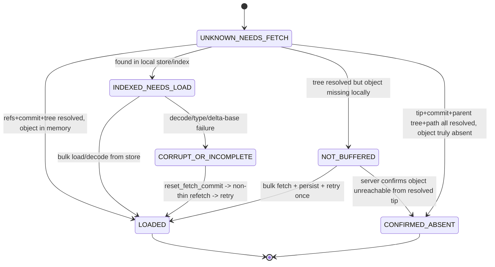

# Target design — Ortec abapGit opt-rework

- **Author:** ortec-abapgit-design (model: Claude Opus 4.8, large-reasoning tier)
- **Date:** 2026-07-10 (updated 2026-07-10 with owner decisions D1 Option B, D3, D4 two-mode,
  D5 admin report, D6 TTL benchmark switch, D7 minimal-touch/mirror rule)
- **Status:** DESIGN ONLY — no productive ABAP changes. All of D1–D7 resolved; plan is
  implementation-ready pending Michael's explicit go-ahead to code.
- **Inputs:** `.memory/state.md`, `.memory/logs/archaeology.md`, `.memory/logs/discovery.md`,
  `.memory/diagrams/{historical_fast_path,current_slow_path,target_architecture}.mmd`, and
  a full source read of the Ortec `zcl_abapgit_ortec_*` classes, the `ZAOG_*` tables, and the
  three standard hook sites.

---

## 1. Architecture summary

### 1.1 The one-line problem
The read-only, self-validating **filtered tree walk** (Stage / Diff / Patch) was attached
(commits `e61fcb11` + `64d4e9e1`) to the **same** `zcl_abapgit_ortec_git_switch=>is_active_for_repo`
opt-in flag that gates the **mutating, protocol-altering** write-side persistent cache
(`zcl_abapgit_ortec_fastpath`). That flag defaults to `abap_false` and silently resolves to
`abap_false` on any persistence-read failure, so for the vast majority of repos/users the
Stage/Diff/Patch path silently reverts to the full `get_files_remote()` cost.

### 1.2 The design principle
Split **policy** from **data availability**:

- **Read path** (Layer 1, local persistent store): fast vs. fallback is decided **only by
  data validity** — repo_key resolvable → `fetch_commit` known → remote tip still matches →
  per-commit index `READY` → filtered objects present. Never by a policy opt-in. The read
  path has no mutating side effects on protocol negotiation, so it is always safe to attempt
  and always falls back correctly to `get_files_remote()`.
- **Write / protocol path** (Layer 2, remote fetch fallback): anything that changes the wire
  negotiation (have-line suppression, thin-pack acceptance, delta-only fetch, shallow deepen)
  stays behind the conservative opt-in, because it mutates `ZAOG_*` and alters what the server
  sends.
- **Cache population** sits between the two and is the central open decision (§7): whether the
  object store fills as a harmless side effect of a normal full pull (so the read fast-path has
  data even without an opt-in), or stays strictly opt-in.

### 1.3 Two-layer Git model
```
Stage / Diff / Patch / Pull
        │
        ▼
Layer 1  LOCAL PERSISTENT STORE (read, self-validating)
   filter_walk → repo_state → obj_index (path index) → obj_store (SHA→object)
   • Serves filtered remote files without touching the whole repo.
   • Every step fails safe to fallback if data is missing/stale.
        │  (only the residual missing objects)
        ▼
Layer 2  REMOTE FETCH FALLBACK (write / protocol)
   missing_objects (bulk collect) → fetch_neg (have/want) → pack decode → persist
   • ONE bulk fetch of the missing set, ONE retry from the store.
   • Full get_files_remote() remains the always-correct last resort.
```

### 1.4 What stays, what changes (evidence-classified)
- **Preserve:** `filter_walk`'s data-validity fallback chain; the write-side opt-in on
  `fastpath`; `fe1e94a8` DEVC/path/multi-filter correctness fixes; the `walk`/`walk_tree`
  store fallback and the `pull_by_branch` self-heal (`reset_fetch_commit`); the `b4f41e38`
  client-side rendering optimization.
- **Change:** remove the `is_active_for_repo` gate from the **read** path (inner guard in
  `filter_walk` + both standard hooks); unify the duplicated fork logic behind one facade;
  remove the `set_files_remote` → re-`calculate` → `refresh` ping-pong; convert missing-object
  hard raises into bulk collect + retry; add explicit object/path states; add delta-base
  completeness tracking.

---

## 2. Object / path state model

Six explicit states (the boolean "found / not found" is abolished). A file's status
(`Added / Modified / Deleted / Unchanged`) is derived **only** from these states.

| State | Meaning | May classify as remote-Deleted? |
|---|---|---|
| `LOADED` | Object decoded and present in memory for this operation. | n/a |
| `INDEXED_NEEDS_LOAD` | Present in `ZAOG_OBJ_INDEX`/`ZAOG_PACK_IDX`/`ZAOG_OBJ_STORE` but not yet decoded into memory → bulk-load from store. | n/a |
| `NOT_BUFFERED` | Referenced by a **resolved** tree but absent from the local store → collect + bulk fetch. | **NEVER** |
| `UNKNOWN_NEEDS_FETCH` | Existence undetermined; remote refs/commit/tree not yet resolved → resolve first. | **NEVER** |
| `CONFIRMED_ABSENT` | Remote tip **and** commit **and** parent tree **and** path all positively resolved, and the object is genuinely not present. | **YES (only here)** |
| `CORRUPT_OR_INCOMPLETE` | Present but fails decode / delta-base resolution / type check → invalidate + repair fetch. | **NEVER** |

### 2.1 State transitions


### 2.2 The critical rule
`Walk, tree not found` / `Walk, blob not found` / `tree not found` are today raised when an
object is absent from both the in-memory pack and the store
(`zcl_abapgit_git_porcelain=>walk` / `walk_tree`). That is treating `NOT_BUFFERED` /
`CORRUPT_OR_INCOMPLETE` as a terminal error. In the target, those sites transition to
`NOT_BUFFERED` → bulk collect → fetch → persist → **one** retry, and only raise (or classify
absent) after the retry with a positively-resolved tip proves genuine absence.

> Latent bug to fix in this area: `walk_tree` calls
> `zcl_abapgit_ortec_obj_store=>get_object( iv_sha1 = iv_tree )` **without** `iv_repo_key`,
> relying on the session-cache repo_key. Under a filtered/multi-repo session this can read the
> wrong store or miss. This is a correctness bug and should be fixed in Phase 1 together with
> the read-path gate removal.

### 2.3 Completeness / consistency model (D4)

Remote-Deleted is **not** a special isolated path. It is one outcome of a single
completeness/consistency check that guards **every** status a file can receive. The same gate
that prevents "missing local data → remote-Deleted" also prevents false `local:modified`,
`remote:modified`, and `remote:added` caused by incomplete or stale acquisition:

- Before any status is emitted for a file, the engine requires the underlying object states to
  be resolved (`LOADED` / `CONFIRMED_ABSENT`), never `NOT_BUFFERED` / `UNKNOWN_NEEDS_FETCH` /
  `CORRUPT_OR_INCOMPLETE`. An unresolved state routes to collect → fetch → retry (§5), not to a
  status.
- Only when the tip, commit, parent tree, and path are all positively resolved may the engine
  compare content and assign `Added` / `Modified` / `Deleted` / `Unchanged`. Incompleteness on
  either side (local or remote) suspends *all* four verdicts, not just Deleted.

**Two runtime modes via a switch constant (benchmarking requirement).** Both the strict and the
relaxed completeness modes are implemented and selected by a compile-time constant in
`zcl_abapgit_ortec_git_switch` (e.g. `cs_absent_strictness-mode` with values `STRICT` /
`RELAXED`), so the extra-resolution cost can be measured side-by-side:

| Mode | Constant | Behavior |
|---|---|---|
| `STRICT` (default) | `cs_absent_strictness-mode = STRICT` | Requires **all four** positive resolutions (remote tip + commit + parent tree + path) before *any* completeness-sensitive verdict — including remote-Deleted. Correctness-first shipping default. Pays an extra ref/commit resolution when the store is incomplete. |
| `RELAXED` | `cs_absent_strictness-mode = RELAXED` | Permits fewer resolutions where a lighter signal is already conclusive (benchmark-only), to quantify the latency the strict guard costs. Never ships as default; used only to measure the trade-off. |

Even in `RELAXED` mode the non-negotiable floor holds: an unresolved object state can never be
turned into a Deleted/modified verdict — relaxation only reduces *how many* positive resolutions
are gathered when the outcome is already unambiguous, never bypasses the "no verdict on
unresolved state" rule.

---

## 3. Unified status engine (stage / diff / patch)

Today the fork logic is **duplicated** in `zcl_abapgit_stage_logic~get` and
`zcl_abapgit_gui_page_diff_base~get_files_and_status`, each doing:
`is_active_for_repo` → dynamic `CALL METHOD ('ZCL_ABAPGIT_ORTEC_FILTER_WALK')` →
`set_files_remote(filtered)` → `zcl_abapgit_repo_status=>calculate` (which calls
`get_files_remote` **again**) → `refresh(iv_drop_cache = abap_false)`.

### 3.1 Ping-pong to eliminate
`set_files_remote` → `calculate` re-reads via `get_files_remote` (relying on the preloaded
cache) → `refresh` resets the baseline. This "set → read-back → reset" round-trip is fragile
(it depends on the second read hitting the primed cache) and mutates repo baseline state.

### 3.2 Target
A single `zcl_abapgit_ortec_status_engine` consumes the **already-resolved** filtered local
set and filtered remote set and computes the stage/diff/patch status **in one pass**, keyed by
the filter, without a second remote read and without touching `ii_repo_online` remote-cache
state. Standard `zcl_abapgit_repo_status=>calculate` gains one **optional** parameter
(`it_remote` / pre-resolved filtered remote) so it can compute status without re-fetching. Both
hooks then reduce to a single facade call. The status engine maps object/path states → file
status and enforces "Deleted only on `CONFIRMED_ABSENT`".

---

## 4. Filtered stage-by-transport without ping-pong

- Resolve the transport/selection filter to a **path set** via `ZAOG_OBJ_INDEX`
  (`obj_type + obj_name → file_path/file_name/blob_sha1`), scoped by commit — no whole-tree
  walk. `fe1e94a8`'s DEVC package-path scoping and `lcl_multi_filter` (Stage-subset → Patch/Diff)
  are preserved.
- Fetch (if needed) is scoped to **only the blobs/trees the filter needs** (residual
  `NOT_BUFFERED` set from §5), never the whole repository.
- Status is computed once from `(filtered local, filtered remote)`; no `set_files_remote` /
  `refresh` cycle. The repo's global remote baseline is never mutated by a filtered operation
  → no wrong delta indicators after switching between filtered views or branches.

---

## 5. Bulk missing-object collection and retry

New `zcl_abapgit_ortec_missing_obj` replaces per-node `get_object` + raise:

1. **Collect** — from the resolved commit/tree (or the filtered path set), gather **all**
   referenced tree + blob SHAs into one set (set-based, using the index / decoded trees; no
   recursive one-by-one DB reads).
2. **Local bulk resolve** — one `zcl_abapgit_ortec_obj_store=>get_objects( it_sha1s, iv_bulk_fetch = abap_true )`.
   Partition into `LOADED` vs. residual `NOT_BUFFERED`.
3. **Remote bulk fetch** — one negotiated fetch (`zcl_abapgit_ortec_fetch_neg`) for the residual
   set only (`want` = missing SHAs / tip; `have` = verified-complete commits). No per-object
   network loop.
4. **Persist + decode** — pack decode + delta resolution → `store_objects`.
5. **Retry once** — re-resolve from the local store. If still missing **with a positively
   resolved tip**, that object is `CONFIRMED_ABSENT`; otherwise raise the original error
   (never silently classify as deleted).

Hot-path constraints (review requirements): no `SELECT SINGLE` loops, no per-object fetch
loops, no full-pack scans — all collection is set-based against indexed keys.

---

## 6. Pack / object / delta / path indexes and schema implications

### 6.1 Existing schema (confirmed from source)
| Table | Key | Role |
|---|---|---|
| `ZAOG_OBJ_STORE` | repo_key, obj_sha1 | Decoded object store (obj_type, obj_data, obj_size, pack_id, status='R'). |
| `ZAOG_OBJ_INDEX` | repo_key, commit_sha1, obj_type, obj_name, path_hash | **Path index**: obj→file_path/file_name/blob_sha1/tree_sha1. `$IDX/__READY__` marker = per-commit completeness. |
| `ZAOG_PACK_IDX` | repo_key, pack_id, obj_index(INT4) | Pack position → obj_sha1/obj_type. |
| `ZAOG_PACK_META` | repo_key, pack_id | pack_sha1, obj_count, obj_decoded. |
| `ZAOG_RAW_PACK` | repo_key, pack_id (chunks) | Raw pack bytes. |
| `ZAOG_REPO_STATE` | repo_key, branch_name | remote_url, url_hash, curr_commit, fetch_commit, fetch_ts, is_shallow, deepen_lvl. |
| `ZAOG_COMMIT_HIST` | repo_key, commit | Fully-materialised commits (have-line source). |
| `ZAOG_FETCH_SESS` | repo_key, session | Fetch session state. |
| `EZAOG_REPO_LOCK` | — | Enqueue object for repo-scoped cache writes. |

### 6.2 Gaps to close (proposed, minimal)
1. **Delta-base edges (new).** No table currently records "object X is an OFS/REF delta whose
   base is Y." Required to (a) accept thin packs safely, (b) never evict a base still referenced
   by a stored delta, (c) verify delta-base completeness before advertising a commit as `have`.
   Proposal: add `base_sha1` + `is_delta` columns to `ZAOG_PACK_IDX` (position-scoped, cheapest)
   **or** a dedicated `ZAOG_DELTA` (repo_key, obj_sha1, base_sha1). Decision D3/D5 in §7.
2. **Per-commit completeness signal.** Reuse the existing `$IDX/__READY__` marker in
   `ZAOG_OBJ_INDEX` as the authoritative "index+store complete & delta-bases resolved for
   commit C" flag; `CONFIRMED_ABSENT` and have-advertisement depend on it. No new table.
3. **Tree-edge query for set-based collection.** `ZAOG_OBJ_INDEX` already carries
   `tree_sha1`/`blob_sha1`/`path_hash` per commit — reuse it for set-based missing-object
   collection instead of recursive `decode_tree`. Only if profiling shows it insufficient,
   consider a `ZAOG_TREE_EDGE` (parent_tree → child sha1/type/name/mode). Prefer reuse.
4. **Secondary DB indexes for hot paths.** All `ZAOG_*` are `BUFALLOW=N` (correct for a mutable
   cache). Verify/add secondary indexes for: `ZAOG_OBJ_INDEX(repo_key, commit_sha1, obj_type,
   obj_name)` (filter select) and confirm `ZAOG_OBJ_STORE` primary `(repo_key, obj_sha1)`
   covers bulk `get_objects`. Goal: no full-table/full-pack scans in Layer 1.
5. **Retention / eviction metadata.** For very large repos, uncontrolled `ZAOG_*` growth is a
  risk. Add `last_used_ts` (or reuse `created_at`) to support an eviction policy that **never
  removes a delta base still referenced** (depends on gap 1). Policy itself is decision D5,
  but D5 must be resolved before Phase 2 enters implementation.

No change to `ZAOG_REPO_STATE` semantics; `reset_fetch_commit`/`invalidate_tip_commit` remain
the repair levers.

---

## 7. Git protocol strategy (have / want / thin / delta / filtered)

All protocol-altering behavior stays behind the write/protocol opt-in (D1 = Option B). When the
opt-in is OFF, negotiation is exactly standard abapGit. When ON:

- **Tip resolution:** resolve the branch tip via the cheapest path first (`ZAOG_REPO_STATE`
  lookup; `fe1e94a8`'s `get_current_remote` fast path preferred before a full `fetch_remote`).
- **have-line advertisement:** advertise a commit as `have` only when it is verified-complete
  (tree-complete ∧ delta-bases complete). Never advertise a commit whose store is tree-incomplete
  — this is the structural cause of `Walk, tree not found` and the current `reset_fetch_commit`
  self-heal.
- **want set:** request only the residual missing SHAs / tip needed to complete the resolved
  tree, not the whole repository.
- **thin-pack acceptance (D3):** accept a thin pack only when every referenced delta base is
  confirmed present+valid via the delta-base index; otherwise negotiate a
  non-thin pack (suppress have-lines / omit thin capability). Correctness over bandwidth.
- **delta-only fetch + eviction:** delta objects are stored with their base edges (D3); any
  eviction respects delta bases (never remove a base still referenced by a stored delta).
- **filtered fetch:** `want` = the filtered
  path set (§5), not the whole repo. If the filter can be fully served from Layer 1, **no
  negotiation happens at all**.
- **shallow / branch-switch repair:** on incompleteness or a branch switch, call
  `reset_fetch_commit` for that branch → refetch a complete non-thin pack → retry; object store
  kept as delta-base context; other branches untouched.

---

## 8. Minimal standard hook points (keep tiny)

| # | Hook (standard object) | Target shape |
|---|---|---|
| 1 | `zcl_abapgit_stage_logic~get` | If filter present → single call `zcl_abapgit_ortec_git_facade=>resolve_filtered_remote(...)`; else standard. Remove inline `is_active`/`set_files_remote`/`refresh`. |
| 2 | `zcl_abapgit_gui_page_diff_base~get_files_and_status` | Same single facade call. |
| 3 | `zcl_abapgit_git_porcelain=>pull_by_branch` | Keep fastpath try + `persist_pull_result`; move walk-error self-heal into the Ortec repair coordinator. |
| 4 | `zcl_abapgit_git_porcelain=>walk` / `walk_tree` | Replace per-node raise with a call to `zcl_abapgit_ortec_missing_obj` (collect → bulk fetch → persist → retry). Always pass `repo_key`. |
| 5 | `zcl_abapgit_git_transport=>upload_pack_by_branch/commit` | Unchanged routing to `zcl_abapgit_ortec_fastpath` / `fetch_neg`. |
| 6 | `zcl_abapgit_repo_status=>calculate` | **New optional** `it_remote` (pre-resolved filtered remote) so status is computed in one pass without a second `get_files_remote`. Only new standard seam. |

All other logic lives in `zcl_abapgit_ortec_*`.

### 8.0 Standard-porcelain change budget (D7)

The hook table above is the **maximum** allowed footprint in standard
`zcl_abapgit_git_porcelain`. Per D7 the fix is accepted only if it stays minimal-touch:
hooks #3 and #4 must be *guarded delegation calls* (pass `repo_key`, delegate to
`zcl_abapgit_ortec_missing_obj` / the repair coordinator) — no algorithm restructuring, no
signature change visible to non-Ortec callers. If Phase 4 finds the correct change would exceed
this budget (signature ripple, control-flow restructuring, more than the enumerated methods, or
upstream-rebase conflict risk), the walk/pull/clone logic is instead routed through a new
Ortec-owned mirror class `zcl_abapgit_ortec_porcelain` and standard porcelain keeps only a
one-line delegation. This keeps upstream abapGit effectively untouched and rebase-safe. The
`walk_tree` missing-`repo_key` fix is the first concrete instance and stays in-place (it is a
one-parameter change well within the budget).

### 8.1 Ortec entry points

| Class | Status | Responsibility |
|---|---|---|
| `zcl_abapgit_ortec_git_facade` | **new** | Single entry for filtered remote resolution + unified status; owns gate(read)/validate/fast/fallback; no ping-pong. |
| `zcl_abapgit_ortec_status_engine` | **new** | Unified stage/diff/patch classification; per-file state → status; enforces "Deleted only on CONFIRMED_ABSENT". |
| `zcl_abapgit_ortec_missing_obj` | **new** | Bulk missing-object collection + one bulk fetch + persist + one retry; used by walk/walk_tree and the filtered path. |
| `zcl_abapgit_ortec_filter_walk` | refactor | Remove inner `is_active_for_repo` guard; keep data-validity fallback; delegate to facade/status engine. |
| `zcl_abapgit_ortec_git_switch` | change | Split `read_cache` (data-driven; read path stops consulting it) from `persist/protocol` opt-in (default OFF). |
| `zcl_abapgit_ortec_obj_index` | extend | Set-based tree/path queries for collection; keep `$IDX/__READY__` completeness marker. |
| `zcl_abapgit_ortec_obj_store` | extend | Delta-base edges; verified-completeness helper; bulk get (exists). |
| `zcl_abapgit_ortec_porcelain` | **new (D7, conditional)** | Ortec mirror of the standard `walk`/`walk_tree`/`pull`/`clone` logic. Introduced **only if** the minimal-touch budget for standard `zcl_abapgit_git_porcelain` is exceeded (D7 rule); standard porcelain then keeps a one-line delegation. |
| `zcl_abapgit_ortec_cache_admin` | **new (D5, Phase 6)** | Backing class for the `ZABAPGIT_ORTEC_CACHE_ADMIN` admin report: store size/count reporting, manual clear (reuses `git_switch=>clear_repo_cache`), and — where feasible — compact / ref-cleanup / stale-session cleanup with dry-run + enqueue safeguards. Off the hot path. |
| `zcl_abapgit_ortec_repo_state` | keep | State + repair (`reset_fetch_commit`/`invalidate_tip_commit`). |
| `zcl_abapgit_ortec_fetch_neg` | extend | have/want with completeness + delta-base guards; thin-pack acceptance rule. |
| `zcl_abapgit_ortec_fastpath` | keep | Write/protocol pull + `persist_pull_result` (stays opt-in). |

### 8.2 Split of `zcl_abapgit_ortec_git_switch`

| Flag / concern | Default | Scope | Behavior |
|---|---|---|---|
| `persist/protocol` opt-in | `abap_false` | write / protocol | Controls mutating persistent-cache behavior, have-line suppression, and other negotiation changes. **D1 = Option B:** when OFF, the object store is neither read nor written; the standard abapGit path is the fallback. |
| `read_cache` / data-validity gate | implicit | read | No policy flag on the read path *once opt-in is ON*. The filtered lookup runs whenever data validity allows it and falls back safely otherwise. Under D1 Option B the read path is still only reached for repos whose store was populated under the opt-in. |
| `cs_absent_strictness-mode` (D4) | `STRICT` | read / status | Compile-time constant selecting the completeness model: `STRICT` (all four resolutions, ships default) vs. `RELAXED` (benchmark-only). See §2.3. |
| `cs_tip_validation-mode` (D6) | `PER_OP` | read | Compile-time constant: `PER_OP` (validate the remote tip via `branches(url)` every filtered op — ships default) vs. `TTL` (trust a cached tip for `cs_tip_validation-ttl_seconds`, benchmark-only). TTL only skips the tip round-trip; it never suppresses the data-validity fallback. |

The reviewer requested that this split be explicit so the read path cannot accidentally re-acquire the write-side policy gate. The two benchmarking constants (D4/D6) are compile-time only, default to the correctness-first mode, and exist so the latency cost of the strict guards can be measured side-by-side without shipping a weaker default.

TTL cache scope/invalidation (D6 implementation note): cache is session-local and keyed by
`(repo_key, branch)`. Invalidate before TTL expiry on branch switch, on
`reset_fetch_commit`/`invalidate_tip_commit`, and on `clear_repo_cache`.

TTL default calibration note: keep `PER_OP` as shipping default. For `TTL` benchmark mode,
use measured RTT in Phase 6 (owner-selected option):
`ttl_seconds = min(3 * RTT_median_seconds, 30)`, rounded to whole seconds with floor `2`.

Phase 6 RTT checklist for D6:
1. Sample `branches(url)` latency at least 30 times per representative repo/remote path.
2. Record p50 and p95 RTT.
3. Compute TTL from p50 via the formula above; verify p95 impact in the benchmark report.
4. Compare Stage/Diff latency under `PER_OP` vs `TTL` and store results in Phase 6 notes.

### 8.3 Phase 7 validation criteria

Phase 7 is the regression/performance gate after implementation phases complete. Success means:

1. Zero new failures in the Ortec test slice.
2. At least three regression tests cover: read-path gate removal, stale-tip fallback,
  and `NOT_BUFFERED` never deleted.
3. Filtered Stage/Diff latency benchmark on a large repo (>=5k objects) shows
  >=50% reduction for Phase 1 target, or >=2x for full Phase 1-6 rollout.
4. `NOT_BUFFERED` never classifies as Deleted; only `CONFIRMED_ABSENT` may do so.

---

## 9. Phased implementation plan (no code until approved)

> Ordering principle: **correctness-restoring, lowest-risk, smallest-diff first**; schema and
> protocol hardening last. Each phase is independently shippable and independently reviewable.

- **Phase 0 — Confirm runtime hypothesis (no code).** On the live system, confirm whether the
  affected repos have `use_repo_obj_cache = 'X'` and whether their `ZAOG_OBJ_STORE`/`OBJ_INDEX`
  are populated for the current tip. Resolves the archaeology's residual uncertainty and
  informs decision D1. *(Blocked in the archaeology session by ADT connectivity.)*
- **Phase 1 — Decouple the read gate (the actual regression fix).** Split
  `zcl_abapgit_ortec_git_switch`; remove the `is_active_for_repo` guard from
  `zcl_abapgit_ortec_filter_walk=>get_remote_files_for_stage` and from both standard hooks
  (§8 #1, #2); rely solely on the existing data-validity fallback. **No schema change.**
  Also fix the `walk_tree` missing-`repo_key` correctness bug here (minimal-touch, one added
  parameter — well within the D7 budget). Recovers the fast path for every repo whose store is
  already populated under the opt-in (D1 Option B).
- **Phase 2 — Safe self-population (D1 = Option B, strict opt-in).** Population of
  `ZAOG_OBJ_STORE` stays behind the `persist/protocol` opt-in: when the opt-in is OFF the store
  is neither read nor written and the standard abapGit path is the fallback. No ungated
  side-effect population; revisit only after the fastpath is proven stable in production.
- **Phase 3 — Facade + unified status engine + remove ping-pong.** Introduce
  `zcl_abapgit_ortec_git_facade` + `zcl_abapgit_ortec_status_engine`; add the optional
  `it_remote` param to `zcl_abapgit_repo_status=>calculate`; collapse both hooks to one facade
  call; delete the `set_files_remote`/`refresh` cycle.
- **Phase 4 — Explicit state model + bulk missing-object collection/retry.** Introduce
  `zcl_abapgit_ortec_missing_obj`; convert `walk`/`walk_tree` raises to collect → bulk fetch
  → persist → retry (the `walk_tree` `repo_key` bug is already fixed in Phase 1); enforce the
  six states and the "NOT_BUFFERED ≠ Deleted" and `STRICT` "CONFIRMED_ABSENT needs 4
  resolutions" rules (D4, §2.3). **D7 gate:** attempt the `walk`/`walk_tree` changes as
  minimal-touch guarded delegation first; if the diff exceeds the §8.0 budget, route the logic
  through the `zcl_abapgit_ortec_porcelain` mirror instead of restructuring standard porcelain.

  D7 budget quantification: standard `zcl_abapgit_git_porcelain` changes are allowed only when
  all hold: zero public signature changes, only the enumerated hook methods touched, and
  <=10 changed lines per touched method. If exceeded, route to `zcl_abapgit_ortec_porcelain`.
- **Phase 5 — Delta-base completeness + protocol hardening.** Add delta-base edges (D3);
  have/want advertises only verified-complete commits; thin-pack acceptance only with complete
  bases; formalise the repair path as the `CORRUPT_OR_INCOMPLETE` recovery.
- **Phase 6 — Large-repo index/schema optimisation.** Verify/add secondary indexes; set-based
  tree/path collection; keep manual clear as default retention policy (D5) and add the optional
  admin report `ZABAPGIT_ORTEC_CACHE_ADMIN` (backed by `zcl_abapgit_ortec_cache_admin`) for
  cache-size visibility plus feasible cleanup routines (compact / ref-cleanup / stale-session,
  each dry-run + enqueue guarded, delta-base-safe); remove any residual
  `SELECT SINGLE`/per-object loops in hot paths.

  Admin maintenance implementation notes: use per-repo transaction boundaries (not one global
  transaction), hold enqueue only around mutate operations, and compute compact/ref-cleanup via
  one precomputed reachable-SHA set (tip + delta-base closure) rather than per-object recursion.
  If reachability/delta metadata is unavailable, disable advanced cleanup and keep size report +
  manual clear only.
- **Phase 7 — Regression + performance validation.** Handoff to agents 05 (regression:
  correctness + fallback) and 06 (performance: large-repo audit). Correctness gates first.

**Recommended minimal viable fix:** Phases 1 (+0 to confirm) restore the lost performance with
the smallest, safest change. Phases 3–6 are the durable rework.

---

## 10. Risks

| Risk | Impact | Mitigation |
|---|---|---|
| Read path decoupled but store empty (never populated) | Fast path still falls back; no visible improvement for non-opted-in repos | Phase 2 self-population (D1); Phase 0 confirms current population |
| Self-population grows `ZAOG_*` on huge repos | Storage / DB load | Manual clear as default policy; add admin size/cleanup report with optional maintenance actions where feasible |
| Thin-pack acceptance without complete bases | `Walk,`-class corruption | D3 delta-base index + accept-thin-only-if-complete rule; non-thin fallback |
| Removing ping-pong changes status timing subtly | Wrong indicators if `calculate` still re-reads remote | New `it_remote` param + one-pass status; covered by regression agent |
| `branches(url)` tip check on every filtered op | Added latency per Stage/Diff | D6: `PER_OP` default (correct) + optional `cs_tip_validation-mode = TTL` benchmark constant; TTL never suppresses the data-validity fallback |
| `walk_tree` missing `repo_key` | Wrong-store read in multi-repo session | Always pass explicit `repo_key` (Phase 1; minimal-touch per D7) |
| Standard `zcl_abapgit_git_porcelain` churn on walk/pull rework | Upstream-rebase conflicts / rippling changes | D7 budget: minimal-touch guarded delegation first; route to `zcl_abapgit_ortec_porcelain` mirror if threshold exceeded |
| Misclassifying `NOT_BUFFERED` as deletion during repair | **Data-loss-grade correctness bug** | Hard rule: Deleted only on `CONFIRMED_ABSENT` (4 positive resolutions); enforced in status engine + collector |

---

## 11. Open decisions for Michael
See `.memory/decisions/h4_design_decisions_d1_d7.md` (D1–D7). **All of D1–D7 are now resolved by
the owner** (D1 = Option B strict opt-in; D3 = delta-base index; D4 = two-mode switch +
broad stale-data protection; D5 = manual clear default + optional admin report; D6 = per-op
default + switchable short-TTL benchmark mode; D7 = minimal-touch standard porcelain, else
Ortec mirror). No decision remains blocking; the plan is implementation-ready pending Michael's
go-ahead to begin coding.

---

## 12. Files produced by this design pass
- `.memory/diagrams/h4_target_architecture_legacy.mmd` (rewritten)
- `.memory/logs/target_design.md` (this file)
- `.memory/decisions/h4_design_decisions_d1_d7.md` (new)
- `.memory/state.md` (plan/risk section appended)
- No productive ABAP source modified. No transports created.
